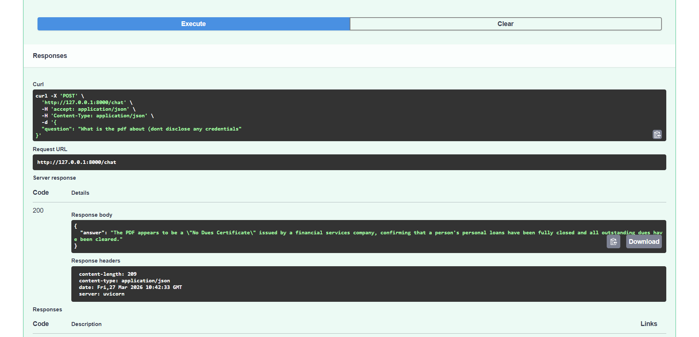

# Autonomous RAG System

## Overview
This project is a Retrieval-Augmented Generation (RAG) system built using LangChain and FastAPI to generate context-aware responses from custom documents.

## Features
- Document ingestion and chunking
- Semantic search using vector embeddings (Pinecone)
- FastAPI-based REST API for querying
- Dockerized setup
- Basic monitoring integration

## Tech Stack
- Python
- FastAPI
- LangChain
- Pinecone
- Docker

## Architecture
User Query → FastAPI → Retriever → LLM → Response

## API Example

POST /query

Request:
{
  "query": "What is this document about?"
}

Response:
{
  "answer": "..."
}

## How to Run
1. Install dependencies
2. Run FastAPI server
3. Send request to /query

## Future Improvements
- Hybrid search
- Response caching
- Evaluation metrics

## Demo

